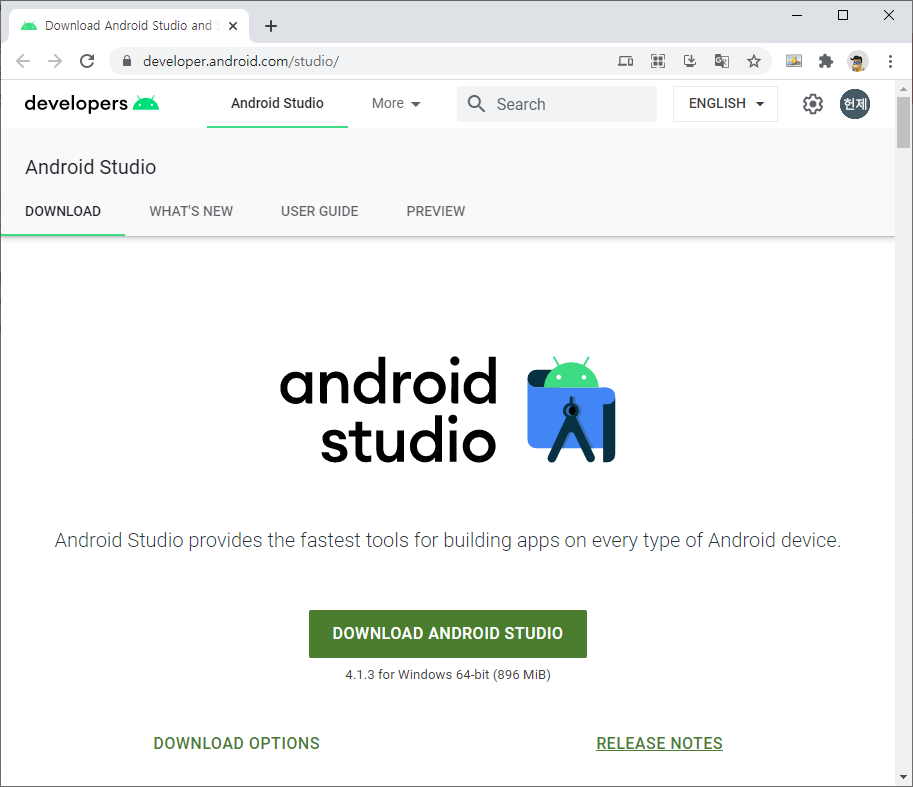
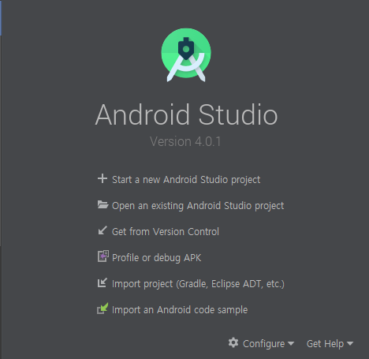
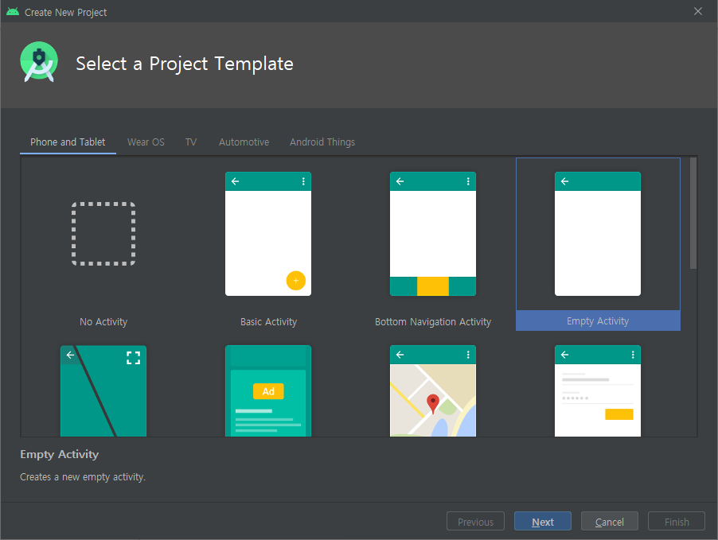
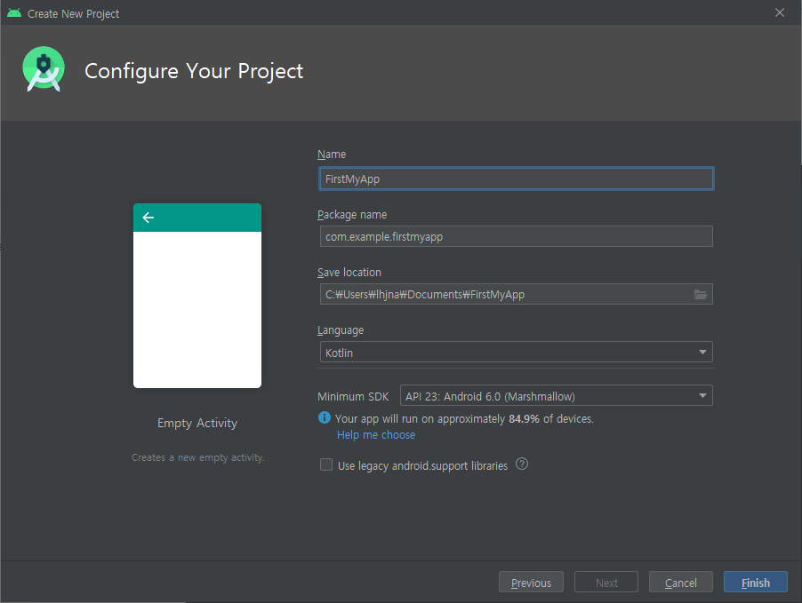
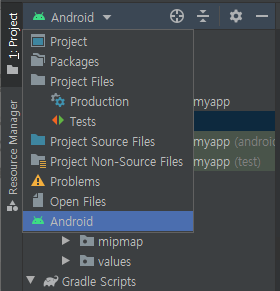
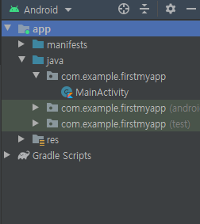
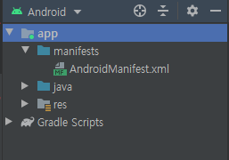
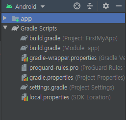
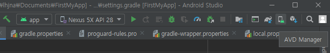

# Badge 1. Build your first app

# 1. Install Android Studio

[](https://developer.android.com/studio/)




## Install Task

1. Android Studio Download 페이지에 들어가서 Android Studio를 다운로드 합니다. 
2. 설치 마법사창에서 Default Configuration (기본 설정) 을 하면 간단하게 설치할 수 있습니다. 
3. 모두 설치한 뒤에는 Android SDK 등을 부수적으로 설치해야 합니다. 
4. 끄읕.


# 2. Get Started !

Hello world! 가 표시되는 기본 앱을 만들어봅니다. 


## Task. Create the Helloworld project


1. Start a new Android Studio Project



2. Selected a Project Tempalte Choose Empty Activity



3. Configure your Project  Language : Kotlin ! 



- Name : 앱 이름을 정합니다.
- Package Name : 패키지 명을 정합니다. 도메인을 사명으로 변경할 수도 있습니다
- Save Location : 저장위치를 정합니다.
- Language : 작성언어를 Java와 Kotlin 중에서 선택할 수 있습니다.
- Minimum SDK : 최소 SDK를 선택할 수 있는데, 선택하면 전체 사용자의 디바이스중 몇 퍼센트를 커버할 수 있는지 표시됩니다.  API 23 : Android 6.0 (Marshmallow) 를 선택했더니, 84.9% 를 실행할 수 있다고 소개해주네요 😎

Finish  버튼을 누르면 끄읕!


## Task. Explore Android Studio

1. 처음 생성하게 되면 Android Studio에서 구동할 수 있는 기본적인 구조로 프로젝트가 생성되어 있습니다.  왼쪽 창에 구조를 살펴볼 수 있도록 Android로 설정해봅시다. 



2. 폴더 구조가 어떻게 되어 있는지 살펴볼까요 ? 



- app 폴더 안에는 manifests, java, res 로 구성되어 있네요.
- java 폴더 안에는 설정했던 package가 생성되어 있고, MainActivity 이름으로 kotlin 파일이 생성되어 있습니다.
- 만약 generatedJava 라는 폴더가 있다면, 앱 빌드파일들이 생성되어 있는 것이니, 해당내용을 수정해서는 안됩니다!


- res 폴더 안에는 이미지를 관리하는 drawable, mipmap 폴더와 레이아웃 리소스를 관리하는 layout, 기타 리소스를 관리하는 values 로 구성됩니다.
- mipmap 폴더는 주로 앱 런처 아이콘을 배치하기 위해 사용됩니다.  [참고](https://android-developers.googleblog.com/2014/10/getting-your-apps-ready-for-nexus-6-and.html)



- manifests 파일은 AndroidManifest.xml 파일을 가지고 있습니다.
- AndroidManifest.xml에서는 안드로이드 시스템에서 필요한 정보를 정의해야 합니다.

간단하게 AndriodManifest.xml 살펴볼까요?

```xml
<?xml version="1.0" encoding="utf-8"?>
<manifest xmlns:android="http://schemas.android.com/apk/res/android"
    package="com.example.firstmyapp">

    <application
        android:allowBackup="true"
        android:icon="@mipmap/ic_launcher"
        android:label="@string/app_name"
        android:roundIcon="@mipmap/ic_launcher_round"
        android:supportsRtl="true"
        android:theme="@style/AppTheme">
        <activity android:name=".MainActivity">
            <intent-filter>
                <action android:name="android.intent.action.MAIN" />

                <category android:name="android.intent.category.LAUNCHER" />
            </intent-filter>
        </activity>
    </application>

</manifest>
```

- activity가 하나있고, intent-filter를 통해서 앱 실행시에 먼저 실행할 Activity가 MainActivity라고 지정해주고 있네요.


### 이제 Gradle Scripts 폴더도 살펴봅시다!



Gradle 은 앱과 의존성 라이브러리, 기타 설정들을 기술해서 빌드해주는 빌드 자동화 시스템입니다. 

- build.gradle (project: {ProjectName}) 은 프로젝트를 구성하는 모든 모듈에 공통적인 구성 옵션이 포함되어 있습니다. 모든 Android Studio 프로젝트에는 최상위 Gradle 빌드 파일 하나가 포함되어 있습니다. 이 파일은 프로젝트의 모든 모듈에 공통적인 그래들 저장소 및 종속성을 정의합니다.
- build.gradle (Module: app) 은 모듈 레벨 build.gradle 파일을 통해 각 모듈에 대한 빌드 설정을 구성할 수 있습니다. (이 앱에는 앱 자체에 대한 모듈이 하나만 있습니다만 settings.gradle을 통해서 여러 개의 모듈로도 구성할 수 있습니다. ) 이 build.gradle 파일은 앱 수준 빌드 구성을 변경할 때 가장 자주 편집하는 파일입니다. 예를 들어 앱에서 지원하는 SDK 수준을 변경하거나 종속성 섹션에서 새 종속성을 선언할 때 이 build.gradle 파일을 편집합니다.

i


## Task. Run your app on a virtual device(emulator)


이 단계에서는 Android Virtual device manager (AVD) 를 통해서 가상 디바이스를 생성하고, 앱을 실행시켜볼 것입니다. 

**Step1.** Create an android virtual device (AVD)

**Tools > AVD Manager** 를 실행시켜봅니다. 툴바에 있는 아이콘을 통해서도 실행할 수 있습니다. 



**Step2.** Create Virual Device 를 클릭해서 새 가상 디바이스를 생성합니다.


**Step3.** Select Hardware 

가상 디바이스의 Resolution Density, Size 등 스펙을 정의할 수 있습니다. 정의된 하드웨어를 사용하셔도 좋고, New Hardware Profile 로 새 하드웨어 스펙으로 시작할 수도 있습니다.  


**Step4.** Select Image 

가상 디바이스에서 실행될 시스템 이미지를 선택합니다. 


디바이스 이름까지 결정하게 되면 가상 디바이스 생성 완료! 


**Step5.** 앱을 실행시켜봅시다.  가상 디바이스를 선택하고 Run 아이콘을 클릭하세요! 


# 결과!


가상 디바이스에서 "Hello World!"가 표시되는 화면을 볼 수 있습니다.


실제 디바이스에서도 USB를 연결하면, 간단하게 실행시킬 수 있습니다. 그러기 위해서는 다음과 같은 단계를 거쳐야 합니다.


## 실제 디바이스에서 실행하기

**Step1.** USB 디버깅 모드 켜기

실제 디바이스에서 실행하기 위해서는 USB로 디버깅 가능하도록 설정을 해줘야 합니다. 그 과정은 다음과 같습니다. 


**Step2.** 실제 디바이스에서 실행 

USB에 연결하면 "USB 디버깅을 허용하시겠습니까?" 라는 문구가 나옵니다. 승인을 해주고 앱을 실행해봅시다. 가상 디바이스를 선택했던것처럼 실제 디바이스를 선택하여 Run 아이콘을 클릭하면 됩니다. 


# Homework


- Create a new Android project from the Empty Template.
- Open the **`res/strings.xml`** file.
- Change the value of the **`app_name`** string to "My Dice Roller". This name appears in the title bar.
- Create an emulator for a device, targeting any version of Android you like, and run the app. Note how the title of the app changed.

```xml
<resources>
    <string name="app_name">My Dice Roller</string>
</resources>
```


## 결과


