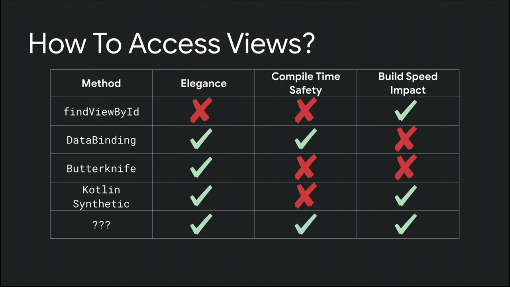

# 03.4:Data binding basics

Created: Apr 1, 2021 12:03 PM
link: https://developer.android.com/codelabs/kotlin-android-training-data-binding-basics?continue=https%3A%2F%2Fdeveloper.android.com%2Fcourses%2Fpathways%2Fkotlin-fundamentals-three%23codelab-https%3A%2F%2Fdeveloper.android.com%2Fcodelabs%2Fkotlin-android-training-data-binding-basics#0

## **Introduction**

- **`findViewById()`**

    expensive and slows down the app, because Android traverses the view hierarchy, starting at the root, until it finds the desired view.

- Data binding has the following benefits:
    - The Android system only traverses the view hierarchy once to get each view, and it happens during app startup, not at runtime when the user is interacting with the app.
    - You get [type safety](https://en.wikipedia.org/wiki/Type_safety) for accessing views. (*Type safety* means that the compiler validates types while compiling, and it throws an error if you try to assign the wrong type to a variable.)

### **Question 1**

Why do you want to minimize explicit and implicit calls to **`findViewById()`**? 

- Every time **`findViewById()`** is called, it traverses the view hierarchy. (o)
- **`~~findViewById()`** runs on the main or UI thread.~~
- These calls can slow down the user interface.
- Your app is less likely to crash.

### **Question 2**

How would you describe data binding?

For example, here are some things you could say about data binding:

- The big idea about data binding is to create an object that connects/maps/binds two pieces of distant information together at compile time, so that you don't have to look for the data at runtime.
- The object that surfaces these bindings to you is called the *binding object*.
- The binding object is created by the compiler.

### **Question 3**

Which of the following is NOT a benefit of data binding?

- Code is shorter, easier to read, and easier to maintain.
- Data and views are clearly separated.
- The Android system only traverses the view hierarchy once to get each view.
- ~~Calling **`findViewById()`** generates a compiler error.~~
- [Type safety](https://en.wikipedia.org/wiki/Type_safety) for accessing views.

### **Question 4**

What is the function of the **`<layout>`** tag?

- You wrap it around your root view in the layout.
- Bindings are created for all the views in a layout.
- It designates the top-level view in an XML layout that uses data binding.
- You can use the **`<data>`** tag in inside a **`<layout>`** to bind a variable to a data class.

### **Question 5**

Which is the correct way to reference bound data in the XML layout?

- **`android:text="@={myDataClass.property}"` (o)**
- **`android:text="@={myDataClass}"`**
- **`android:text="@={myDataClass.property.toString()}"`**
- **`android:text="@={myDataClass.bound_data.property}"`**

→ android:text="@={[myName.name](http://myname.name/)}"