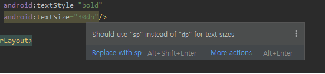
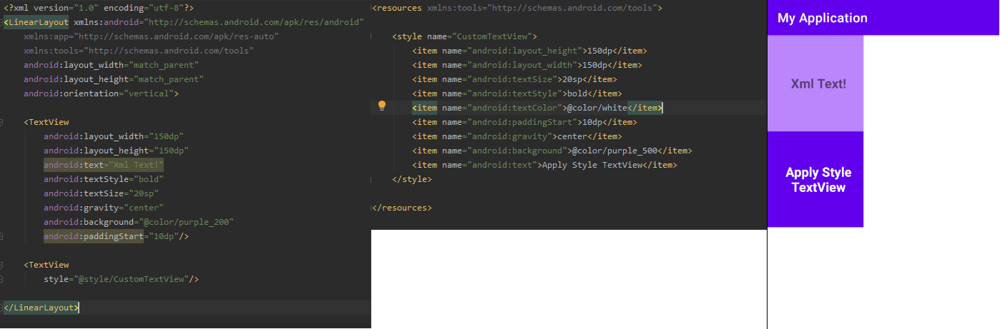
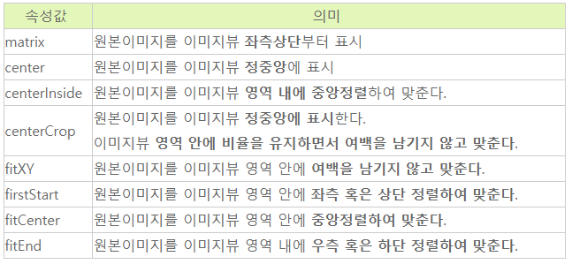
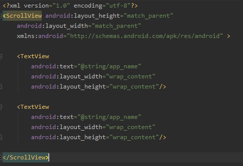
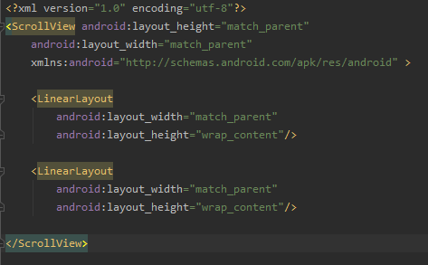
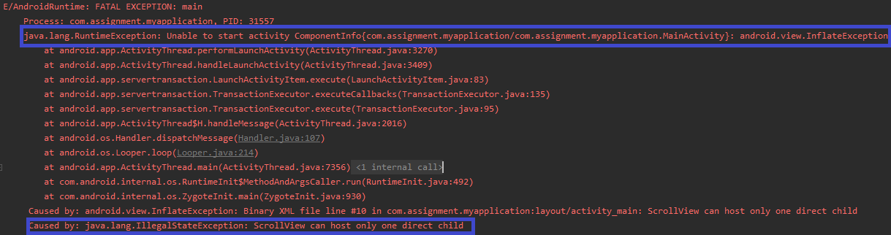

# Use LinearLayout with the Layout Editor

## 뷰와 뷰그룹의 관계(Relationship between views and viewgroups)

- View는 ViewGroup에 배치되며, ViewGroup조차도 뷰로 다루기때문에 위와같은 계층구조로 이루어질 수 있다.
- View상속도는 다음과 같다.

- View Group상속도는 다음과 같다.(즉, ViewGroup은 모든 Layout과 레이아웃을 상속받고있는 뷰들을 말한다.)

## 리니어 레이아웃(LinearLayout)

- 단일 열에서 가로로 정렬 또는 단일 행에서 세로로 정렬하는 레이아웃이다.
- android:orientation = "vertical / horizontal"로 가로로 정렬할 것인지, 세로로 정렬할것인지 지정한다.

- 뷰들의 너비와 높이를 weight를 설정하여 정할수있다.
- orientation이 vertical인 경우 height를 0dp로 설정하고 weight를 설정해주면된다.
- orientation이 horizontal인 경우 width를 0dp로 설정하고 weight를 설정해주면된다.
- 가중치의 총합을 정할 수도있는데, 부모 레이아웃(LinearLayout)에 weightSum을 설정해주면된다.

## 텍스트뷰(TextView)

- 텍스트를 표시하는 기능을 담당하고 있다.
- 텍스트뷰의 텍스트 크기는 sp를 권장하고있다.
	- 가독성 때문인데, 시스템 글꼴크기를 "크게" "아주크게"등으로 설정할 때 dp의 경우는 변화가 없지만 sp의 경우는 커지기 때문이다.

- 속성으로는 다음과 같다.
	- 패딩(Padding), 마진(margin), 정렬위치(gravity) 등등
	- 패딩과 마진의 차이는 패딩은 View의 테두리로부터 컨텐츠 사이의 여백을 말하며, 마진은 부모 레이아웃으로부터 View의 테두리사이의 여백을 말한다.

- API 17이상을 대상으로하는 앱인경우에는 left, right 대신에 start end를 사용하는것이 좋다.

## 스타일(Style)

- View의 속성들을 지정할 수 있다.
- 글꼴, 글꼴 색상, 너비, 높이, 배경색, 패딩, 마진 등등을 설정해줄수 있다.

- Android Studio 4.1.버전으로 올라오면서 기본으로 생성되어진 styles은 없어지고, Theme(default, night)만 있는데, styles을 만들어서 사용해도 되고 Theme에서 사용해도된다.
- 단, Theme에서 만들고 사용할때에는 default와 night에 둘다 만들어줘야하기때문에 styles을 만들어서 사용하는것이 편하다.
- 현재 적용된 텍스트들은 모두 하드코딩된 내용이기 때문에 res/value/string.xml에 정의해서 텍스트를 이용하는것이 좋다.

## 이미지뷰(ImageView)

- 이미지를 표시하는 기능을 담당하고 있다.
- 사용할수 있는 이미지의 확장자는 jpg, gif, png, bitmap 등이다.
- android:src = "image" 또는 app:srcCompat="image"를 통해서 이미지를 넣어줄 수 있는데, srcCompat은 API 21미만의 버전을 지원한다면 사용하여야한다. 또한 srcCompat은 jpg는 사용할 수가 없다.
- 많은 속성들이 있지만 가장 많이 사용하는 scalType은 아래의 사진과 같다.

## 스크롤뷰(ScrollView)

- 화면 밖으로 구성된 뷰가있는 경우, 스크롤 가능하게 해주는 기능을 담당하고 있다.
- 자식뷰 또는 뷰그룹이 하나만 존재할 수 있다.

- 위의 사진과 같이 자식 뷰 또는 뷰그룹을 여러개를 두게되면 런타임에러가 발생한다.
- 에러내용은 다음과 같다.

- 자식 뷰그룹을 하나로 두고 계층적으로 뷰그룹을 더그려갈 수도있다.
- ScrollView -> ViewGroup -> ViewGroup ....

