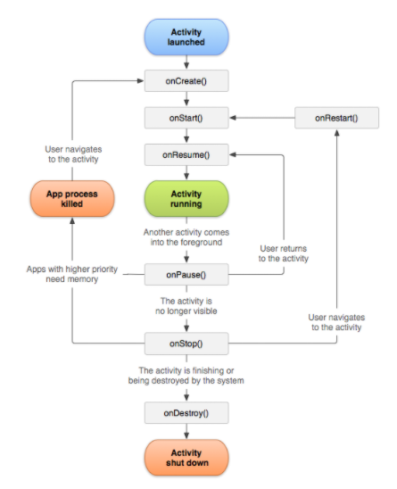
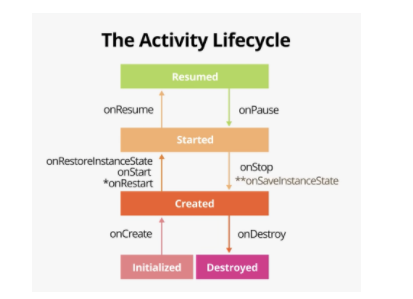

## Activity LifeCycle

- onCreate()
	- 액티비티가 생성될때 실행되는 메소드입니다.
	- 액티비티의 전체 수명주기동안 한번만 발생해야하는 로직을 실행합니다.
	- 예는 데이터바인딩, viewmodel 및 일부변수 인스턴스화가 있습니다.
	
- onRestart()
	- onStop()이 호출된 후 액티비티가 다시 시작될때 실행되는 메소드입니다.

- onStart()
	- 액티비티가 보여질때 호출됩니다.
	- 액티비티가 사용자에게 표시됩니다.
	- 액티비티가 상호작용할 수 있도록 포그라운드에 보낼 준비를 합니다.
	- 예는 UI를 관리하는 코드를 초기화합니다.

- onResume()
	- 액티비티가 포커스를 가질때 호출됩니다.
	- 앱이 사용자와 상호작용합니다.
	- 어떠한 이벤트가 발생하여 앱에서 포커스가 떠나기 전까지 이 상태에 머뭄니다.
	- 포커스가 떠나는 예는 전화가 오거나, 다른활동으로 이동하거나, 기기 화면이 꺼지는 이벤트 등을 말합니다.

- onPause()
	- 액티비티가 포그라운드에 있지않음을 나타냅니다. (다만 멀티윈도우 상황에서는 여전히 보일수 있습니다.)
	- 시스템 리소스, 센서 와 같은 배터리 수명에 영향을 주는 모든 리소스를 해제할 수 있습니다.
	- 다만 멀티윈도우상황에서는 보일 수 있기때문에 UI관련 리소스와 작업을 해제하거나 조정할때에는 onStop()을 이용하는 것이 좋습니다.
	- 또한, 어플리케이션 또는 사용자 데이터 저장, 네트워크호출, 데이터베이스 트랜잭션같은경우는 부하가 크기 때문에 onStop()을 이용해야합니다.

- onStop()
	- 액티비티가 사용자에게 완전히 보여지지 않은 경우 호출됩니다.
	- 예는 새로운 액티비티가 화면 전체 차지할 경우입니다.
	- 앱이 사용자에게 보여지지 않는 동안 필요하지 않은 리소스를 해제하거나 조정해야합니다.
	- 예는 애니메이션을 일시중지하거나, 세밀한 위치업데이트에서 대략적인 위치업데이트로 조정합니다.
	- CPU를 비교적 많이 사용하는 종료작업을 실행합니다.

- onDestory()
	- 액티비티가 소멸될때 불려지는 메소드입니다.
	- 사용자가 액티비티를 닫거나 finish가 호출되어 활동이 종료되는경우
	- 멀티윈도우 또는 기기회전으로인해 시스템이 일시적으로 활동을 소멸시키는 경우
	- onStop()에서 아직 해제되지않은 모든리소스를 해제해야합니다.

- onResume에서 등록한 리소스는 onPause에서 해제하여야하고, onStart에서 등록한 리소스는 onStop에서 해제해야합니다.
- 해당방법은 개발자가 잊어버리는 경우가 발생한다면 예기치않은 문제가 발생할수 있기 때문에 LifecycleObserver가 사용되어집니다.

- 기기회전이나 멀티윈도우에서 값을 유지하기위해 사용되어지는 방법은 onCreate, onRestoreInstanceState, onSaveInstanceState가 사용되며, 더나아가면 viewmodel를 이용합니다.
- onSaveInstanceState의 파라미터인 outState에 값이 들어가야만 onRestoreInstanceState는 작동합니다.
- onCreate() -> onStart() -> onRestoreInstanceState() -> onResume() -> onPause() -> onStop() -> onSaveInstanceState() -> onDestroy()

## adb란?
- Android Debug Bridge의 약자로, 안드로이드 장치와 통신하여 디버그 등의 작업을 할 수 있는 툴입니다.
- 주로 어플 설치, 디버깅, 삭제등을 포함하며 장치 정보 및 발생되는 로그를 볼 수 있으며, 스크린샷, 화면녹화, 시스템 어플리케이션 비활성화 등의 다양한 명령을 내릴수 있는 툴입니다.
