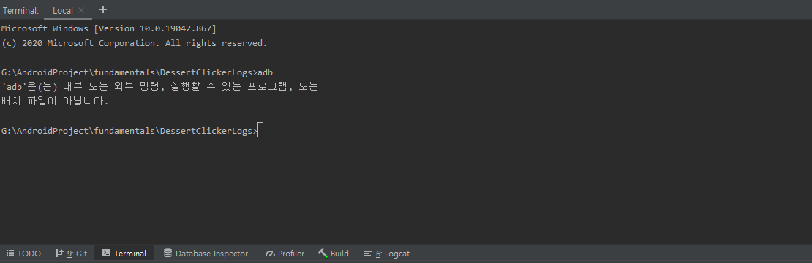
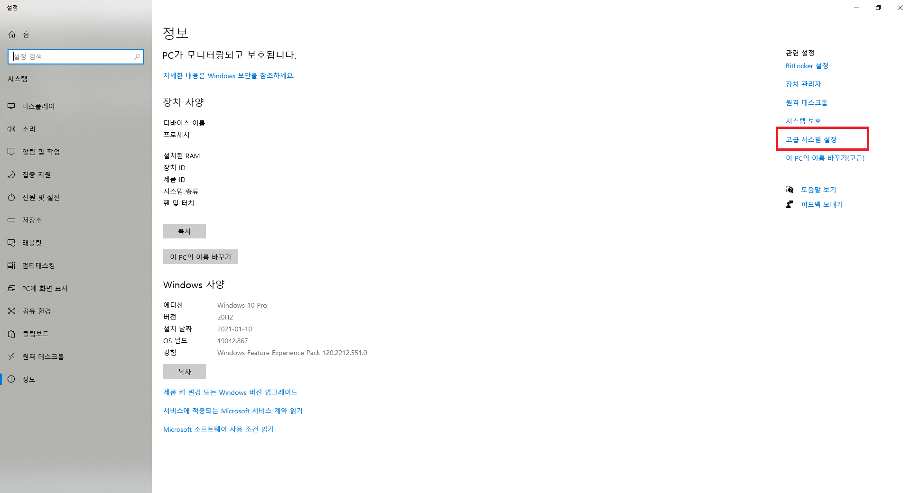
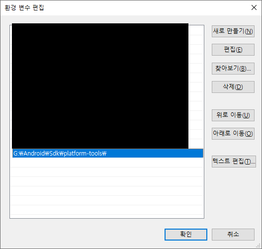
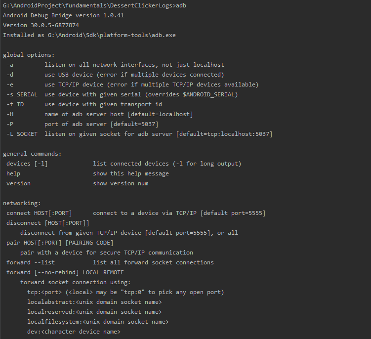

## adb란?
- Android Debug Bridge의 약자로, 안드로이드 장치와 통신하여 디버그 등의 작업을 할 수 있는 툴입니다.
- 주로 어플 설치, 디버깅, 삭제등을 포함하며 장치 정보 및 발생되는 로그를 볼 수 있으며, 스크린샷, 화면녹화, 시스템 어플리케이션 비활성화 등의 다양한 명령을 내릴수 있는 툴입니다.

## adb 사용법

- Device
	- 먼저 사용기기의 개발자 옵션을 활성화 합니다.
	- 다음으로는 USB디버깅을 활성화합니다.

- Android Studio
	- 하단에 있는 Terminal탭을 누른후, adb를 타이핑합니다.
	- 설정이 되지않았다면 아래와 같은 문구가 나옵니다.

	- 환경변수 설정을 해줍니다.

	- pc속성으로 들어간후 우측의 고급 시스템설정에 들어간 후, 고급 탭에서 환경변수를 클릭합니다.

	- 시스템 변수의 Path에 adb.exe가 있는 폴더를 입력해줍니다.
	- adb.exe는 sdk/platform-tools에 있습니다.
	- 다시 adb를 타이핑하면 다음과 같이 나옵니다.

