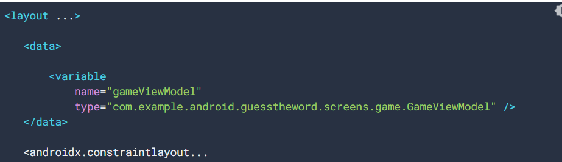
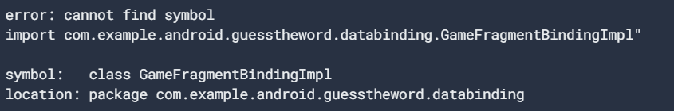

#6-3 Data binding with ViewModel and LiveData

*뷰모델과 라이브데이타를 사용한 데이터바인딩
### 크게 3가지 활용법이 존재합니다. 


**첫번째) 뷰모델과 데이터바인딩 활용 
1. ViewModel 에 대한 DataBiding 추가


위 그림과 같이 VM을 XML 변수로 설정하자. 
```
// Set the viewmodel for databinding - this allows the bound layout access 
// to all the data in the ViewModel
binding.gameViewModel = viewModel
```
그리고 이 변수에 뷰모델을 초기화 해준다.


2. 리스너 바인딩 사용
```
<Button
   android:id="@+id/skip_button"
   ...
   android:onClick="@{() -> gameViewModel.onSkip()}"
   ... />
```
위와 같이 사용시 액티비티 Or 프레그먼트에서 클릭리스너를 사용하지 않고 
뷰모델에서 정의한 함수를 사용 할수 있다.

```
//필요없어지는 구문 
binding.skipButton.setOnClickListener { onSkip() } 
```
이러면 ViewModel 객체의 함수와 직접적으로 연결되기 때문에, 셋온 클릭리스너를 사용할 필요없다.


3.데이터 바인딩 문법 오류 해결

앱이 데이터 바인딩을 사용하는 경우 컴파일에서 데이터 바인딩에 사용되는 클래스를 생성.
앱을 컴파일 하기전에 문법 에러가 있어도 경고 나 빨간색 코드가 표시되지 않음.
대신에 컴파일 타임에 생성 된 클래스에서 오류를 표시해줍니다.

```
//원래 변수 name은 gameViewModel이지만 x를 잘못 추가 한다 하면.. 
<data>
   <variable
       name="gameViewModelx"
       type="com.example.android.guesstheword.screens.game.GameViewModel" />
</data>
```


error:cannot find symbol 같이 에러명과 위치를 보여줍니다. 


**두번째) 데이터 바인딩과 LiveData 활용 방법

ViewModel에 val word:LiveData<String>가 존재한다고 하면,   

```
/** Setting up LiveData observation relationship **/
viewModel.word.observe(viewLifecycleOwner, Observer { newWord ->
   binding.wordText.text = newWord
})
```
아래 설명을 듣는다면 더 이상 위 코드는 사용할 필요가 없습니다.


1.액티비티에서 바인딩의 라이프사이클를 설정해줍니다.
```
binding.lifecycleOwner = viewLifecycleOwner
```

2. XML에서 해당 라이브데이타 객체를 사용할 곳에 넣어줍니다.
```
<TextView
   android:id="@+id/word_text"
   ...
   android:text="@{gameViewModel.word}"
   ... />
```

이렇게 사용한다면 라이브데이타의 observe 함수를 사용하지 않고 바로 최신 값이 업데이트 됩니다.


**세번째) 뷰모델과 데이터바인딩 활용
데이터바인딩을 이용한 레이아웃에서 문자열 서식이 추가가 가능합니다.


1. res -> string.xml 에서 아래와 같이 설정해줍니다.

```
<string name="quote_format">이것은 \"%s\"입니다.</string>
```

2. 레이아웃에서 다음과 같은 형식으로 적용하면 됩니다.
```
<TextView
   android:id="@+id/word_text"
   ...
   android:text="@{@string/quote_format(gameViewModel.word)}"
   ... />

//결과: 텍스트뷰에 이것은 xx 입니다가 표시가 됩니다.
```

위와 같이 사용하면 더이상, 아래와 같이 사용할 필요가 없습니다.
``` 
viewModel.word.observe(viewLifecycleOwner, Observer { word ->
   binding.wordText.text = String.format(...) 
})
```

Question 1
Which of the following statements is not true about listener bindings?

Listener bindings are binding expressions that run when an event happens.
Listener bindings work with all versions of the Android Gradle plugin.
Listener bindings are written as lambda expressions.
Listener bindings are similar to method references, but they let you run
 arbitrary data-binding expressions.
 
Question 2
Assume your app includes this string resource:
<string name="generic_name">Hello %s</string>

Which of the following is the correct syntax for formatting the string,
 using the data-binding expression?

android:text= "@{@string/generic_name(user.name)}"
android:text= "@{string/generic_name(user.name)}"
android:text= "@{@generic_name(user.name)}"
android:text= "@{@string/generic_name,user.name}"

Question 3
When is a listener-binding expression evaluated and run?

When the data held by the LiveData is changed
When an activity is re-created by a configuration change
When an event such as onClick() occurs
When the activity goes into the background