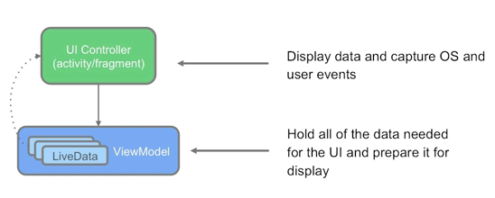

# ViewModel

### Objective

1. The starter app doesn't save and restore the app state during configuration changes, such as when the device orientation changes, or when the app shuts down and restarts.
   * `onSaveInstanceState()`  requires us to add extra codes to save and retrieve the state from a bundle
   * We should keep the size of data in a bundle as minimal as possible. (Limitation on the size of a bundle, 500KB to 1MB)
2. The game screen does not navigate to the score screen when the user taps the **End Game** button.

### How to solve?

1. We can make it by using the recommended App architecture.  This diagram shows how all the modules should interact with one another after designing the app.

   

2. This codelab follows the *separation of concern* design principle, dividing classes into sections addressing distinctive concerns.
   * UI with Activity / Fragment
   * ViewModel and Repository <- current scope
   * Model and Data sources


### Overview of ViewModel, ViewModelProvider, and ViewModelFactory

1. Definition of ViewModel

   > *The `ViewModel` class is designed to store and manage UI-related data in a lifecycle conscious way. The `ViewModel` class allows data to survive configuration changes such as screen rotations.*

     A `ViewModel` can do simple calculations and transformations on data to prepare the data to be displayed by the UI controller. In this architecture, the `ViewModel` performs the decision-making, and UI component works according to the data transformed in the ViewModel.

   

   

   ```groovy
   implementation 'androidx.lifecycle:lifecycle-viewmodel-ktx:2.2.0'
   ```

   ```kotlin
   class GameViewModel : ViewModel() {
      init {
          Log.i("GameViewModel", "GameViewModel created!")
      }
     
     override fun onCleared() {
        super.onCleared()
        Log.i("GameViewModel", "GameViewModel destroyed!")
     }
   }
   ```

   

2. Definition of ViewModelProvider

    During configuration changes such as screen rotations, UI controllers such as fragments are re-created. However, `ViewModel` instances survive. If you create the `ViewModel` instance using the `ViewModel` class, *a new object is created every time the fragment is re-created.* Instead, create the `ViewModel` instance using a `ViewModelProvider`.

   > **Important:** Always use`ViewModelProvider` to create `ViewModel` objects rather than directly instantiating an instance of `ViewModel`.

   ```kotlin
   private lateinit var viewModel: GameViewModel
   viewModel = ViewModelProvider(this).get(GameViewModel::class.java)
   ```

   * `ViewModelProvider` returns an existing `ViewModel`, otherwise creates a new one.

   * `ViewModelProvider` creates a `ViewModel` instance in the given scope (`Activity` or `Fragment`).

     

3. Definition of ViewModelFactory

   A `ViewModelFactory` instantiates `ViewModel` objects, with or without constructor parameters.

   In this example, you want a `ViewModel` to hold the score, and  you will pas in the score value during the `ViewModel` initialization.

   > **Factory method pattern** that uses factory methods to create objects.

   

   ```kotlin
   class ScoreViewModel(finalScore: Int) : ViewModel() {
      // The final score
      var score = finalScore
      init {
          Log.i("ScoreViewModel", "Final score is $finalScore")
      }
   }
   ```

   ```kotlin
   class ScoreViewModelFactory(private val finalScore: Int) : ViewModelProvider.Factory {
     override fun <T : ViewModel?> create(modelClass: Class<T>): T {
        if (modelClass.isAssignableFrom(ScoreViewModel::class.java)) {
            return ScoreViewModel(finalScore) as T
        }
        throw IllegalArgumentException("Unknown ViewModel class")
     }
   }
   ```

   ```kotlin
   // code for sending score, which is put into ScoreViewModel as a parameter
   val action = GameFragmentDirections.actionGameToScore()
      action.score = viewModel.score
      NavHostFragment.findNavController(this).navigate(action)
   }
   ```

   

   ```kotlin
   private lateinit var viewModel: ScoreViewModel
   private lateinit var viewModelFactory: ScoreViewModelFactory
   
   viewModelFactory = ScoreViewModelFactory(ScoreFragmentArgs.fromBundle(arguments!!).score)
   viewModel = ViewModelProvider(this, viewModelFactory).get(ScoreViewModel::class.java)
   ```


### Homework

1. To avoid losing data during a device-configuration change, you should save app data in which class?
   - `ViewModel` 
   - `LiveData`
   - `Fragment`
   - `Activity`
2. A `ViewModel` should never contain any references to fragments, activities, or views. True or false?
   - True 
   - False

3. When is a `ViewModel` destroyed?
   - When the associated UI controller is destroyed and recreated during a device-orientation change.
   - In an orientation change.
   - When the associated UI controller is finished (if it's an activity) or detached (if it's a fragment). 
   - When the user presses the Back button.

4. What is the `ViewModelFactory` interface for?
   - Instantiating a `ViewModel` object.
   - Retaining data during orientation changes.
   - Refreshing the data being displayed on the screen.
   - Receiving notifications when the app data is changed.