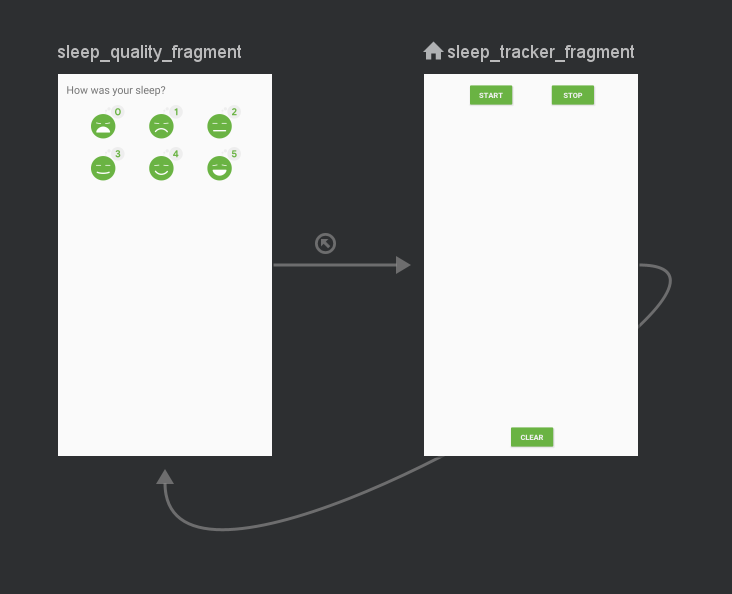
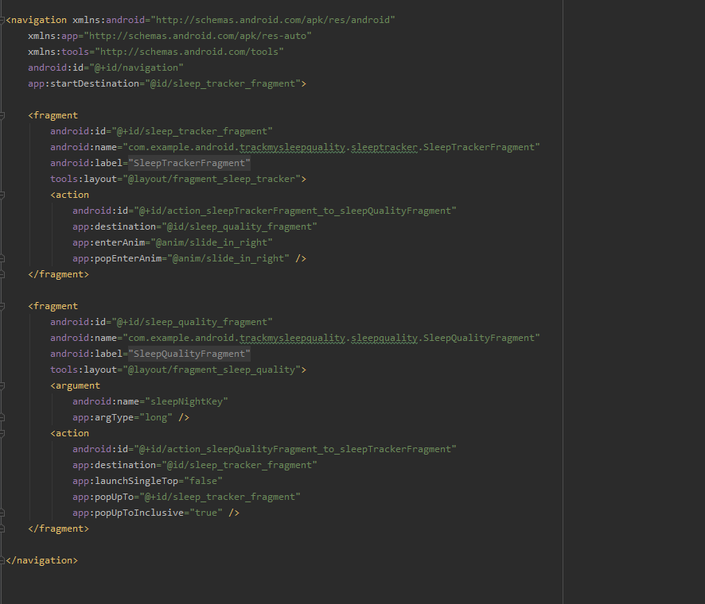

## Use LiveData to control Button states

# Task: Add navigation(네비게이션 추가)

step1. Inspect the code

- 먼저 [준비된 앱](https://github.com/google-developer-training/android-kotlin-fundamentals-starter-apps/tree/master/TrackMySleepQualityStates-Starter)을 다운받습니다.
- navigation.xml을 열어봅니다.



- navigation.xml의 argument 이름이 sleepNightKey인 것을 확인합니다.



- 해당 값은 이전에 알아둔 safe-args를 이용해 전달됩니다.

step2. Add navigation for sleep-quality tracking

- SleepTrackgerFragment에서 SleepQualityFragment로 이동하는 액션이 정의되어 있지만, 클릭핸들러는 구현되어있지 않습니다.
- LiveData observe 통해 어떠한 값이 트리거가 되면 목적지로 이동을 합니다.

- 먼저 SleepTrackerViewModel에 캡슐화된 LiveData를 만들어줍니다.

```kotlin
private val _navigationToSleepQuality = MutableLiveData<SleepNight>()

val navigationToSleepQuality: LiveData<SleepNight>
    get() = _navigationToSleepQuality
```

- LiveData의 값을 리셋해주는 doneNavigation() function을 만들어줍니다.

```kotlin
fun doneNavigating(){
    _navigationToSleepQuality.value = null
}
```

- onStopTracking()안의 코루틴 스코프 안에 다음내용을 추가해줍니다.

```kotlin
fun onStopTracking() {
    viewModelScope.launch {
        ...
        _navigationToSleepQuality.value = oldNight
    }
}
```

- SleepTrackerFragment의 onCreateView에 LiveData를 옵저브해주고, navigate를 설정해줍니다.

```kotlin
sleepTrackerViewModel.navigationToSleepQuality.observe(viewLifecycleOwner, Observer { night->
    night?.let {
        this.findNavController().navigate(SleepTrackerFragmentDirections.actionSleepTrackerFragmentToSleepQualityFragment(night.nightId))
        sleepTrackerViewModel.doneNavigating()
    }
})
```

# Task: Record the sleep quality

step1. Create a ViewModel and a ViewModelFactory(뷰모델과 뷰모델 팩토리 생성)

- SleepQualityViewModel를 열고 아래와 같이 작성을 해줍니다.

```kotlin
class SleepQualityViewModel(private val sleepNightKey: Long = 0L, val database: SleepDatabaseDao) : ViewModel()
```

- 앞선 테스크와 같이 캡슐화된 LiveData와 리셋해주는 function을 만들어줍니다.

```kotlin
private val _navigateToSleepTracker = MutableLiveData<Boolean?>()
    val navigateToSleepTracker: LiveData<Boolean?>
        get() = _navigateToSleepTracker

fun doneNavigating(){
    _navigateToSleepTracker.value = null
}
```

- onSetSleepQuality()라는 이름의 click handler를 만들어줍니다.
	- viewModelScope를 사용하며, 데이터베이스에서 sleepNightKey 값을 가져옵니다.
	- 가져온 값의 sleepQuality를 업데이트 해주고, 이전에 만들어준 LiveData에 true 값을 넣어줍니다.

```kotlin
fun onSetSleepQuality(quality: Int){
    viewModelScope.launch {
        val tonight = database.get(sleepNightKey) ?: return@launch
        tonight.sleepQuality = quality
        database.update(tonight)

        _navigateToSleepTracker.value = true
    }
}
```

- 뷰모델 팩토리도 생성해줍니다.

```kotlin
class SleepQualityViewModelFactory(private val sleepNightKey: Long, private val dataSource: SleepDatabaseDao) : ViewModelProvider.Factory{
    @Suppress("UNCHECKED_CAST")
    override fun <T : ViewModel?> create(modelClass: Class<T>): T {
        when{
            modelClass.isAssignableFrom(SleepQualityViewModel::class.java)->{
                return SleepQualityViewModel(sleepNightKey, dataSource) as T
            }
        }
        throw IllegalStateException("Unknown ViewModel class")
    }
}
```

step2. Update the SleepQualityFragment

- navigation arguments를 이용하여 bundle을 가져옵니다.

```kotlin
val arguments = SleepQualityFragmentArgs.fromBundle(requireArguments())
```

- 데이터베이스에서 Dao를 가져옵니다.

```kotlin
val dataSource = SleepDatabase.getInstance(application).sleepDatabaseDao
```

- 번들의 sleepNightKey와 dao를 이용하여 팩토리를 생성해줍니다.

```kotlin
val viewModelFactory = SleepQualityViewModelFactory(arguments.sleepNightKey, dataSource)
```

- 뷰모델을 참조합니다.

```kotlin
val sleepQualityViewModel = ViewModelProvider(this, viewModelFactory).get(SleepQualityViewModel::class.java)
```

- 바인딩객체에 뷰모델을 추가합니다.

```kotlin
binding.sleepQualityViewModel = sleepQualityViewModel
```

- 앞서 선언한 LiveData를 observe합니다.
```kotlin
sleepQualityViewModel.navigateToSleepTracker.observe(viewLifecycleOwner, Observer {
    if (it == true){
        this.findNavController().navigate(
                SleepQualityFragmentDirections.actionSleepQualityFragmentToSleepTrackerFragment()
            )
            sleepQualityViewModel.doneNavigating()
        }
})
```
step3. Update the layout file and run the app

- layout file에 viewModel변수를 추가해줍니다.

```xml
<data>
       <variable
           name="sleepQualityViewModel"
           type="com.example.android.trackmysleepquality.sleepquality.SleepQualityViewModel" />
</data>
```

- 각 이미지뷰에 onClick을 추가해줍니다.

```xml
android:onClick="@{() -> sleepQualityViewModel.onSetSleepQuality(5)}"
```

# Tast: Control button visibility and add a snackbar

step1. Update button states

- sleep-tracker-fragment의 버튼에 아래의 내용을 추가해줍니다.
	- start : tonight이 null인경우 enable
	- stop : tonight이 null이 아닌경우 enable
	- clear : nights의 값이 존재하는경우 enable 

```xml
android:enabled="@{sleepTrackerViewModel.startButtonVisible}"

android:enabled="@{sleepTrackerViewModel.stopButtonVisible}"

android:enabled="@{sleepTrackerViewModel.clearButtonVisible}"
```

- SleepTrackerViewModel에 추가해줍니다.

```kotlin
val startButtonVisible = Transformations.map(tonight) {
   it == null
}
val stopButtonVisible = Transformations.map(tonight) {
   it != null
}
val clearButtonVisible = Transformations.map(nights) {
   it?.isNotEmpty()
}
```

step2. Use a snackbar to notify the user

- SleepTrackerViewMoel에 캡슐화된 LiveData를 넣어줍니다. 리셋해줄 function도 추가해주고, onClear안에서 라이브데이터에 값을 넣어줍니다.

```kotlin
private var _showSnackbarEvent = MutableLiveData<Boolean>()

val showSnackBarEvent: LiveData<Boolean>
   get() = _showSnackbarEvent

fun doneShowingSnackbar() {
   _showSnackbarEvent.value = false
}

fun onClear() {
    viewModelScope.launch {
        ...
        _showSnackbarEvent.value = true
    }
}
```

- SleepTackerFragment에서 위의 Event값을 observe합니다.

```kotlin
sleepTrackerViewModel.showSnackbarEvent.observe(viewLifecycleOwner, Observer {
    if (it == true){
        Snackbar.make(requireActivity().findViewById(android.R.id.content), getString(R.string.cleared_message), Snackbar.LENGTH_SHORT).show()
        sleepTrackerViewModel.doneShowingSnackbar()
    }
})
```

Question 1

One way to enable your app to trigger navigation from one fragment to the next is to use a LiveData value to indicate whether or not to trigger navigation.
(앱이 Framgnet에서 다음 Fragment로의 탐색을 트리거 할 수 있도록하는 한 가지 방법은 LiveData 값을 사용하여 navigation을 트리거할지 여부를 나타내는 것입니다.)
What are the steps for using a LiveData value, called gotoBlueFragment, to trigger navigation from the red fragment to the blue fragment? Select all that apply:
(gotoBlueFragment라는 LiveData 값을 사용하여 redFramgnet에서 blueFragment로의 탐색을 트리거하는 단계는 무엇입니까? 해당되는 모든 것들을 고르세요)

- In the ViewModel, define the LiveData value gotoBlueFragment.
(ViewModel안에서 gotoBlueFragment의 값을가진 LiveData를 정의합니다.)
- In the RedFragment, observe the gotoBlueFragment value. Implement the observe{} code to navigate to BlueFragment when appropriate, and then reset the value of gotoBlueFragment to indicate that navigation is complete.
(RedFragment안에서 gotoBlueFragment값을 observe합니다. 적절한 경우 	Observer {} 코드를 구현하여 BlueFragment로 이동 한 다음 gotoBlueFragment 값을 재설정하여 탐색이 완료되었음을 나타냅니다.)
- Make sure your code sets the gotoBlueFragment variable to the value that triggers navigation whenever the app needs to go from RedFragment to BlueFragment.
(코드에서 gotoBlueFragment 변수를 앱이 RedFragment에서 BlueFragment로 이동해야 할 때마다 탐색을 트리거하는 값으로 설정하는지 확인합니다.)
- Make sure your code defines an onClick handler for the View that the user clicks to navigate to BlueFragment, where the onClick handler observes the goToBlueFragment value.
(코드에서 사용자가 BlueFragment로 이동하기 위해 클릭하는 View에 대한 onClick 핸들러를 정의해야합니다. 여기서 onClick 핸들러는 goToBlueFragment 값을 관찰합니다.)

정답 : 1,2,3

Question 2
You can change whether a Button is enabled (clickable) or not by using LiveData. How would you ensure that your app changes the UpdateNumber button so that:
(LiveData를 사용하여 Button 활성화 (클릭 가능) 여부를 변경할 수 있습니다. 앱이 다음과 같이 UpdateNumber 버튼을 변경하도록하려면 어떻게해야합니까?)
The button is enabled if myNumber has a value greater than 5.
(myNumber의 값이 5보다 큰 경우 버튼이 활성화됩니다.)
The button is not enabled if myNumber is equal to or less than 5.
(myNumber가 5보다 작거나 같으면 버튼이 활성화되지 않습니다.)
Assume that the layout that contains the UpdateNumber button includes the <data> variable for the NumbersViewModel as shown here:
(UpdateNumber 버튼이 포함 된 레이아웃에 다음과 같이 NumbersViewModel에 대한 <data> 변수가 포함되어 있다고 가정합니다.)

<data>
   <variable
       name="NumbersViewModel"
       type="com.example.android.numbersapp.NumbersViewModel" />
</data>
Assume that the ID of the button in the layout file is the following:
(레이아웃 파일의 버튼 ID가 다음과 같다고 가정합니다.)
android:id="@+id/update_number_button"

What else do you need to do? Select all that apply.
(그 밖에 무엇을해야합니까? 해당되는 모든 것들을 고르세요.)

- In the NumbersViewModel class, define a LiveData variable, myNumber, that represents the number. Also define a variable whose value is set by calling Transform.map() on the myNumber variable, which returns a boolean indicating whether or not the number is greater than 5.
(NumbersViewModel 클래스에서 숫자를 나타내는 LiveData 변수 myNumber를 정의합니다. 또한 myNumber 변수에 대해 Transform.map ()을 호출하여 값이 설정된 변수를 정의하면 숫자가 5보다 큰지 여부를 나타내는 부울을 반환합니다.)

Specifically, in the ViewModel, add the following code:
(특히 ViewModel에서 다음 코드를 추가합니다.)

```kotlin
val myNumber: LiveData<Int>

val enableUpdateNumberButton = Transformations.map(myNumber) {
   myNumber > 5
}
```

- In the XML layout, set the android:enabled attribute of the update_number_button button to NumberViewModel.enableUpdateNumbersButton.
(XML 레이아웃에서 update_number_button 버튼의 android : enabled 속성을 NumberViewModel.enableUpdateNumbersButton으로 설정합니다.)

```xml
android:enabled="@{NumbersViewModel.enableUpdateNumberButton}"
```

- In the Fragment that uses the NumbersViewModel class, add an observer to the enabled attribute of the button.
(NumbersViewModel 클래스를 사용하는 Fragment에서 버튼의 활성화 된 속성에 관찰자를 추가합니다.)

Specifically, in the Fragment, add the following code:
(특히 조각에 다음 코드를 추가합니다.)

```kotlin
// Observer for the enabled attribute
viewModel.enabled.observe(this, Observer<Boolean> { isEnabled ->
   myNumber > 5
})
```

In the layout file, set the android:enabled attribute of the update_number_button button to "Observable".
(레이아웃 파일에서 update_number_button 버튼의 android : enabled 속성을 "Observable"로 설정합니다.)

정답 : 2