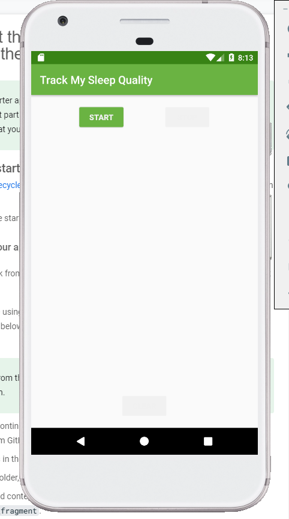

# Badge 7-7. Interact with RecyclerView items

# Task : Get the starter code and inspect the changes to the app

**Step1.** 먼저 [준비된 앱](https://github.com/google-developer-training/android-kotlin-fundamentals-starter-apps/tree/master/RecyclerViewClickHandler-Starter)을 다운로드 받습니다. 수면 세부 정보를 기입하기 위한 앱입니다. 



**Step2.** 수면 상세 화면을 위한 코드를 훑어보기 

이 codelab 에서는 취침 시간을 위한 **Click Handler**를 구현합니다. 

클릭하면 앱이 특정 수면에 대한 세부 정보를 보여주는 fragement로 이동합니다. 시작 코드에는 이에 대한 **fragment**와 **navGraph**가 이미 포함되어 있습니다. 

우선, 스타터 프로젝트를 살펴보겠습니다. 스타터 프로젝트는 다음과 같은 구조로 되어 있습니다. 


패키지를 보면, 

- sleepdetail : 하룻밤 수면에 대한 세부 정도를 표시하는 fragment와 viewmodel이 포함되어 있습니다.
    - `SleepDetailFragment`를 간단하게 살펴보자면

```kotlin
override fun onCreateView(inflater: LayoutInflater, container: ViewGroup?,
                              savedInstanceState: Bundle?): View? {

				**/** DataBinding **/**
        // Get a reference to the binding object and inflate the fragment views.
        val binding: FragmentSleepDetailBinding = DataBindingUtil.inflate(
                inflater, R.layout.fragment_sleep_detail, container, false)

				**/** Bundle **/**
        val application = requireNotNull(this.activity).application
        val arguments = SleepDetailFragmentArgs.fromBundle(arguments)

				**/** Database **/**
        // Create an instance of the ViewModel Factory.
        val dataSource = SleepDatabase.getInstance(application).sleepDatabaseDao
        val viewModelFactory = SleepDetailViewModelFactory(arguments.sleepNightKey, dataSource)

				**/** ViewModel : link with database **/**
        // Get a reference to the ViewModel associated with this fragment.
        val sleepDetailViewModel =
                ViewModelProvider(
                        this, viewModelFactory).get(SleepDetailViewModel::class.java)

				**/** Databinding link with viewmodel **/**
        // To use the View Model with data binding, you have to explicitly
        // give the binding object a reference to it.
        binding.sleepDetailViewModel = sleepDetailViewModel

        binding.setLifecycleOwner(this)

				**/** Navigation **/**
        // Add an Observer to the state variable for Navigating when a Quality icon is tapped.
        sleepDetailViewModel.navigateToSleepTracker.observe(viewLifecycleOwner, Observer {
            if (it == true) { // Observed state is true.
                this.findNavController().navigate(
                        SleepDetailFragmentDirections.actionSleepDetailFragmentToSleepTrackerFragment())
                // Reset state to make sure we only navigate once, even if the device
                // has a configuration change.
                sleepDetailViewModel.doneNavigating()
            }
        })

        return binding.root
    }
```

마치 다음과 같은 구조로 fragment를 설계하고 있습니다!


`ViewModel`을 살펴보면 Database에서 LiveData를 가져오는 것을 알 수 있죠. 

```kotlin
class SleepDetailViewModel(
        private val sleepNightKey: Long = 0L,
        dataSource: SleepDatabaseDao) : ViewModel() {

    /**
     * Hold a reference to SleepDatabase via its SleepDatabaseDao.
     */
    val database = dataSource

    private val night: LiveData<SleepNight>

    fun getNight() = night

    init {
        night=database.getNightWithId(sleepNightKey)
    }

		/**
     * Variable that tells the fragment whether it should navigate to [SleepTrackerFragment].
     *
     * This is `private` because we don't want to expose the ability to set [MutableLiveData] to
     * the [Fragment]
     */
    private val _navigateToSleepTracker = MutableLiveData<Boolean?>()

    /**
     * When true immediately navigate back to the [SleepTrackerFragment]
     */
    val navigateToSleepTracker: LiveData<Boolean?>
        get() = _navigateToSleepTracker

    /**
     * Call this immediately after navigating to [SleepTrackerFragment]
     */
    fun doneNavigating() {
        _navigateToSleepTracker.value = null
    }

    fun onClose() {
        _navigateToSleepTracker.value = true
    }
}
```

```kotlin
@Entity(tableName = "daily_sleep_quality_table")
data class SleepNight(
        @PrimaryKey(autoGenerate = true)
        var nightId: Long = 0L,

        @ColumnInfo(name = "start_time_milli")
        val startTimeMilli: Long = System.currentTimeMillis(),

        @ColumnInfo(name = "end_time_milli")
        var endTimeMilli: Long = startTimeMilli,

        @ColumnInfo(name = "quality_rating")
        var sleepQuality: Int = -1)
```

`ViewModelFactory`가 하는 일도 잠깐 살펴봅시다.  뷰모델을 생성해주는데, Key와 데이터소스를 넣어주고 있습니다. 

```kotlin
class SleepDetailViewModelFactory(
        private val sleepNightKey: Long,
        private val dataSource: SleepDatabaseDao) : ViewModelProvider.Factory {
    @Suppress("unchecked_cast")
    override fun <T : ViewModel?> create(modelClass: Class<T>): T {
        if (modelClass.isAssignableFrom(SleepDetailViewModel::class.java)) {
            return SleepDetailViewModel(sleepNightKey, dataSource) as T
        }
        throw IllegalArgumentException("Unknown ViewModel class")
    }
}
```

xml 부분도 데이터바인딩을 잘 해주고 있습니다. 

```xml
<data>
    <variable
        name="sleepDetailViewModel"
        type="com.example.android.trackmysleepquality.sleepdetail.SleepDetailViewModel" />
</data>
```

# Task : Make item clickable

자 이제 이 프로젝트에서 RecyclerView에 있는 Item에 대한 click이 가능하도록 해봅시다. RecyclerView는 앞서 살펴봤던 Fragment가 아닌 `SleepTrackerFragment` 에 있습니다. 

Recycler에서 하나의 Item 을 가장 잘 나타내고 있는 것은 `ViewHolder` 입니다.  클릭을 들을 수 있는 좋은 장소이지만 처리하기에는 적합한 장소가 아닙니다. 

- 후보 1 ) Adapter : 데이터 항목이 표시되므로 Adapter에서 클릭을 처리할 수 있습니다. 하지만 아키텍쳐적인 관점에서 Adapter의 역할은 앱 로직을 다루는 것이 아니라 디스플레이용 데이터를 조정하는 것입니다. **(사용처가 ViewHolder와 비슷하다고 생각합니다.)**
- 후보 2) ViewModel : 일반적으로 클릭에 대한 응답으로 발생해야 하는 작업을 결정하기 위해 데이터 및 로직을 처리하기에 적합합니다.  `Win`

**Step1.** Adapter에서 Click Listener 

1. SleepNightAdapter.kt 에서 리스너를 생성합니다. 

```kotlin
class SleepNightListener(val clickListener: (sleepId: Long) -> Unit) {
   fun onClick(night: SleepNight) = clickListener(night.nightId)
}
```

2. list_item_sleep_night.xml 에서 clicklistener를 바인딩 시킵니다. 

```xml
<data>
		<variable
        name="sleep"
        type="com.example.android.trackmysleepquality.database.SleepNight"/>
    <variable
        name="clickListener"
        type="com.example.android.trackmysleepquality.sleeptracker.SleepNightListener" />
</data>

<androidx.constraintlayout.widget.ConstraintLayout
    android:layout_width="match_parent"
    android:layout_height="wrap_content"
    android:onClick="@{() -> clickListener.onClick(sleep)}"
    >
```

람다 표현식을 쓰면 굳이 `onClick(view : View)` 가 아니여도 함수를 넣을 수 있습니다.  아이템도 함께 바인딩되어 있기 때문에 어떤 항목이 click되었는지 쉽게 알 수 있습니다. 

**Step2.** ViewModel에 ClickListener 전달 

1. 어뎁터 생성시 clickListener를 등록할 수 있도록 생성자에 넣어줍니다. 

```kotlin
class SleepNightAdapter(val clickListener: SleepNightListener):
       ListAdapter<SleepNight, SleepNightAdapter.ViewHolder>(SleepNightDiffCallback()) {
```

2. viewholder에서 데이터와 clicklistener를 바인딩시킵니다.  당연히 holder에서도 실제 바인딩하는 쪽에 연결시켜줘야겠죠?

```kotlin
// onBindViewHolder
holder.bind(getItem(position)!!, clickListener)

// ViewHolder
fun bind(item: SleepNight, clickListener: SleepNightListener) {
            binding.sleep = item
            binding.clickListener = clickListener
            binding.executePendingBindings()
        }

```

3. Adapter 생성시 clicklistener를 넣어봅시다. 

```kotlin
// SleepTrackerFragment
val adapter = SleepNightAdapter(SleepNightListener { nightId ->
            Toast.makeText(context, "${nightId}", Toast.LENGTH_LONG).show()
        })
```

# Task : Handle item clicks

저희는 `ViewModel`에서 `click`에 대한 처리 로직을 담당하기로 했었죠. ViewModel에서 onclick을 처리해봅시다. 물론 그 값을 프로퍼티로 관리해야죠.

```kotlin
private val _navigateToSleepDetail = MutableLiveData<Long>()
val navigateToSleepDetail
    get() = _navigateToSleepDetail
fun onSleepNightClicked(id: Long) {
    _navigateToSleepDetail.value = id
}
```

기본 값 처리도 해봅시다. 

```kotlin
fun onSleepDetailNavigated() {
    _navigateToSleepDetail.value = null
}
```

이제 `fragment`에서 adapter를 생성할때 이 메소드를 통해서 정의하면 되겠죠? Toast로 처리했던 부분을 변경시켜 줍시다. 

```kotlin
val adapter = SleepNightAdapter(SleepNightListener { nightId ->
    sleepTrackerViewModel.onSleepNightClicked(nightId)
})
```

이제 아이템 뷰가 클릭되면, ViewModel의 메소드가 호출되고 값을 LiveData에 저장합니다. 이제 LiveData의 값이 변경될때의 처리만 해주면 끝나게 되겠죠! 

우리 모두가 알고 있듯이 observe 함수는 이 일을 훌륭하게 해냅니다 😀

```kotlin
sleepTrackerViewModel.navigateToSleepDetail.observe(viewLifecycleOwner, Observer { night ->
    night?.let {
        this.findNavController().navigate(
                SleepTrackerFragmentDirections
                        .actionSleepTrackerFragmentToSleepDetailFragment(night))
        sleepTrackerViewModel.onSleepDetailNavigated()
    }
})
```

# Answer these questions

## Question 1

**Assume that your app contains a `RecyclerView` that displays items in a shopping list. Your app also defines a click-listener class:  다음과 같은 클릭 리스너가 구현되어 있습니다.**  

```kotlin
class ShoppingListItemListener(val clickListener: (itemId: Long) -> Unit) {    
	fun onClick(cartItem: CartItem) = clickListener(cartItem.itemId)
}
```

**How do you make the `ShoppingListItemListener` available to data binding? Select one.** 

**데이터 바인딩으로 ShoppingListItemListener를 사용하도록 만들려면 어떻게 만들래요?**

- In the layout file that contains the **`RecyclerView`** that displays the shopping list, add a **`<data>`** variable for **`ShoppingListItemListener`**.

    **RecyclerView를 정의한 xml에서 <variable> - <data>로 Listener를 정의합니다.**

- In the layout file that defines the layout for a single row in the shopping list, add a **`<data>`** variable for **`ShoppingListItemListener`**.

    **단일 행에 대한 xml에 <variable> - <data> 로 Listener를 정의합니다.**

- In the **`ShoppingListItemListener`** class, add a function to enable data binding:

    **다음과 같은 데이터바인딩 활성화 함수를 기입합니다.**

```kotlin
fun onBinding (cartItem: CartItem) {dataBindingEnable(true)}
```

- In the **`ShoppingListItemListener`** class, inside the **`onClick()`** function, add a call to enable data binding:

    **Listener 클래스 안에 onClick을 정의할때 데이터바인딩 활성화 함수를 기입합니다.**

```kotlin
fun onClick(cartItem: CartItem) = {     
	clickListener(cartItem.itemId)    
	dataBindingEnable(true)
}
```

- 정답

    **2번**) **** In the layout file that defines the layout for a single row in the shopping list, add a **`<data>`** variable for **`ShoppingListItemListener`**. 

## **Question 2**

Where do you add the **`android:onClick`** attribute to make items in a **`RecyclerView`** respond to clicks? Select all that apply.

**RecyclerView 의 항목이 클릭에 반응하기 위해서 android:onClick 속성을 어디에 추가해야합니까?**

- In the layout file that displays the **`RecyclerView`**, add it to **`<androidx.recyclerview.widget.RecyclerView>`**

    **RecyclerView 가 정의되어 있는 xml에서 추가합니다.** 

- Add it to the layout file for an item in the row. If you want the entire item to be clickable, add it to the parent view that contains the items in the row.

    **각 항목에 대한 xml 에 추가합니다. 만약 전체 선택을 원한다면, 행을 포함한 parentView에서 추가할 수도 있습니다.**  

- Add it to the layout file for an item in the row. If you want a single **`TextView`** in the item to be clickable, add it to the **`<TextView>`**.

    **각 항목에 대한 xml에 추가합니다. 만약 TextView에만 하고 싶으면 TextView에 추가합니다.** 

- Always add it the layout file for the **`MainActivity`**.

    **항상 MainActivity가 있는 xml에 추가합니다.**

- 정답

    **2번)** Add it to the layout file for an item in the row. If you want the entire item to be clickable, add it to the parent view that contains the items in the row.

    **3번)** Add it to the layout file for an item in the row. If you want a single **`TextView`** in the item to be clickable, add it to the **`<TextView>`**.