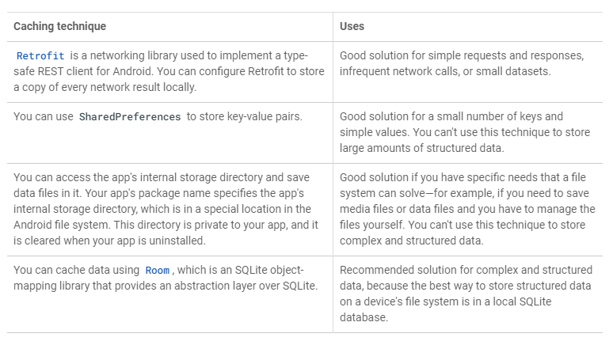
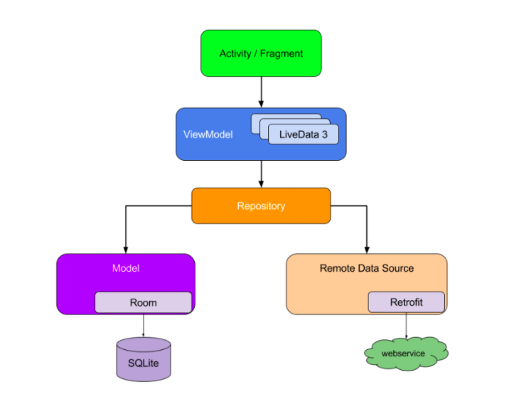

# Add a Repository

## Caching

- 네트워크에서 데이터를 가져온 후 앱 은 데이터를 기기의 저장소에 저장하여 데이터를 캐시 할 수 있습니다.
	- 장치가 오프라인 일 때 또는 동일한 데이터에 다시 액세스하려는 경우
	- 네트워크 작업 실행 프로세스를 단순화하고 앱의 다양한 영역에서 코드 중복을 줄일 때(즉, 네트워크 작업 캡슐화)

- Retrofit은 Android용으로 Type-Safe REST 클라이언트를 구현하는데 사용되어지는 라이브러리이며, 모든 네트워크의 결과의 사본을 로컬에 저장하도록 구성할 수 있다.
	- 간단한 요청 및 응답, 빈번한 네트워크 요청 또는 소규모 데이터 셋에 적합한 솔루션

- SharedPreferences을 이용하여 키-값 쌍을 저장한다.
	- 적은 수의 키와 간단한 값에 적합한 솔루션
	- 단, 많은 양의 구조화된 데이터를 저장할 수 없음

- 앱의 내부 저장소 디렉토리에 액세스하고 데이터 파일을 저장할 수 있으며, 앱의 패키지이름은 Android File System의 특수위치에있는 디렉토리를 지정합니다. 해당 디렉토리는 앱 전용이며, 앱을 제거할시 지워집니다.
	- 미디어파일 또는 데이터파일을 저장, 파일을 직접관리해야하는 경우와 같은 파일 시스템으로 해결 할 수 있는 특정요구사항에 적합한 솔루션
	- 복잡하고 구조화된 데이터를 저장할 수 없음

- SQLite를 통해 추상화 계층을 제공하는 object 매핑 라이브러리인 Room을 이용하여 데이터를 캐시할 수 있다.
	- 장치의 File System에 구조화된 데이터를 저장하는 가장좋은 솔루션은 로컬 SQLite DB를 이용하는 것
	- 복잡하고 구조화된 데이터에 권장하는 솔루션

## Repository

- Repository Pattern은 앱의 나머지부분에서 데이터 소스을 분리하는 디자인 패턴
- 데이터 소스와 나머지 앱간에 중재한다.(예로는 Persistent Model, Web services and caches)
- 코드 분리 및 아키텍처에 권장되는 방법

- Repository의 장점
	- 데이터 작업을 처리하고 여러 백앤드를 사용할 수 있음
	- 네트워크에서 데이터를 가져올지 또는 로컬 데이터베이스에 캐시된 결과를 사용할지 결정하기위한 논리를 구현
	- 코드를 모듈화하고 테스트 할 수 있음.

### Question 1

Which component in the Android Architecture Components is responsible for keeping the offline cache up-to-date and getting data from the network?  
(Android 아키텍처 구성 요소의 어떤 구성 요소가 오프라인 캐시를 최신 상태로 유지하고 네트워크에서 데이터를 가져 오는 역할을합니까?)

- ViewModel

- LiveData

- Repository

- Activities

정답 : 3번

### Question 2

What is the best way to save structured data on the device file system for offline caching?  
(오프라인 캐싱을 위해 장치 파일 시스템에 구조화 된 데이터를 저장하는 가장 좋은 방법은 무엇입니까?)

- Room

- Files

- Shared preferences

- Retrofit caching

정답 : 1번

### Question 3

The Transformations.map converts one LiveData into another _______.  
(Transformations.map은 하나의 LiveData를 다른 ______ 것 으로 변환합니다.)

- ViewModel

- LiveData

- Repository

- DAO object

정답 : 2번

### Question 4

When implementing offline caching, which one of the following strategies is a good example of the concept of separation of concerns?  
(오프라인 캐싱을 구현할 때 다음 전략 중 관심 사 분리 개념의 좋은 예는 무엇입니까?)

- Create separate classes to represent the network, domain, and database objects.  
(네트워크, 도메인 및 데이터베이스 개체를 나타내는 별도의 클래스를 만듭니다.)

- Create a single class to represent the network, domain, and database objects.  
(네트워크, 도메인 및 데이터베이스 개체를 나타내는 단일 클래스를 만듭니다.)

- Create a single class to represent the network and domain objects, and another class to represent the database object.  
(네트워크 및 도메인 개체를 나타내는 단일 클래스와 데이터베이스 개체를 나타내는 다른 클래스를 만듭니다.)

- Create a single class to represent the network object and another class to represent the database and domain objects.  
(네트워크 개체를 나타내는 단일 클래스와 데이터베이스 및 도메인 개체를 나타내는 다른 클래스를 만듭니다.)

정답 : 1번